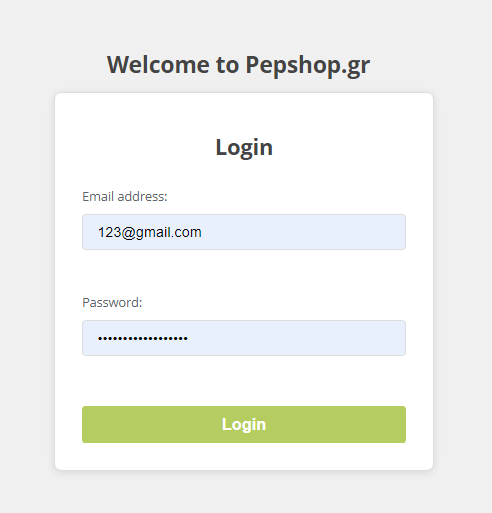
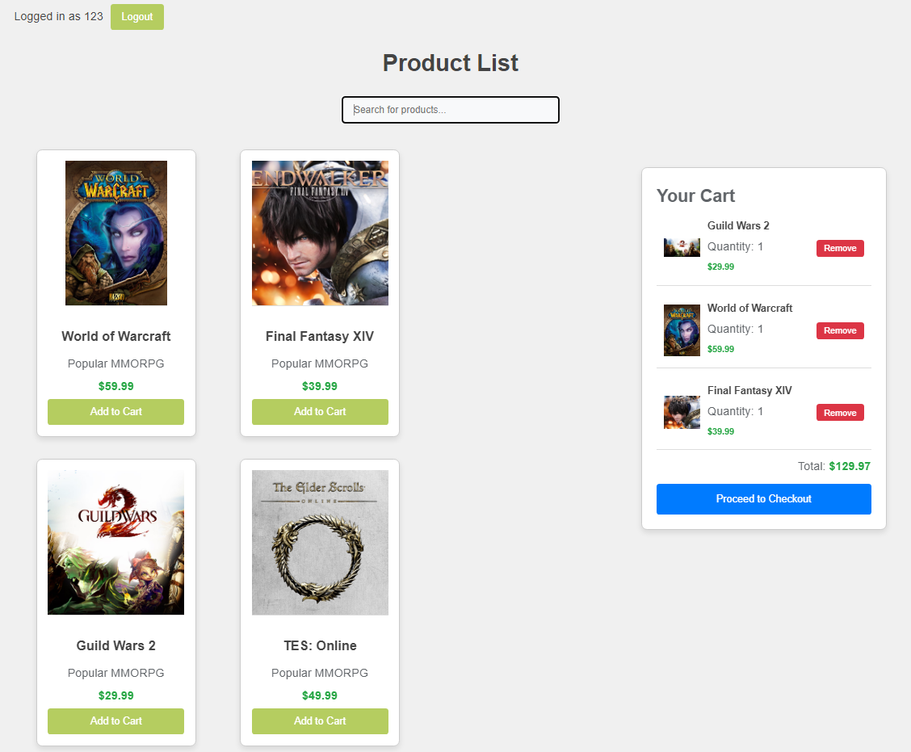
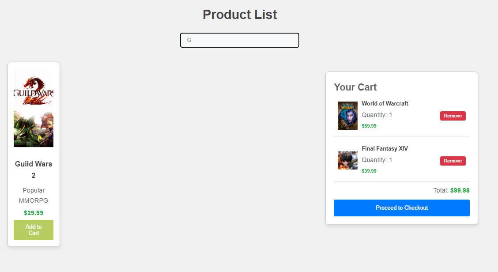
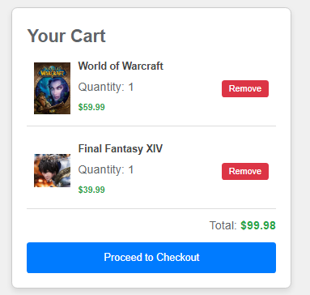
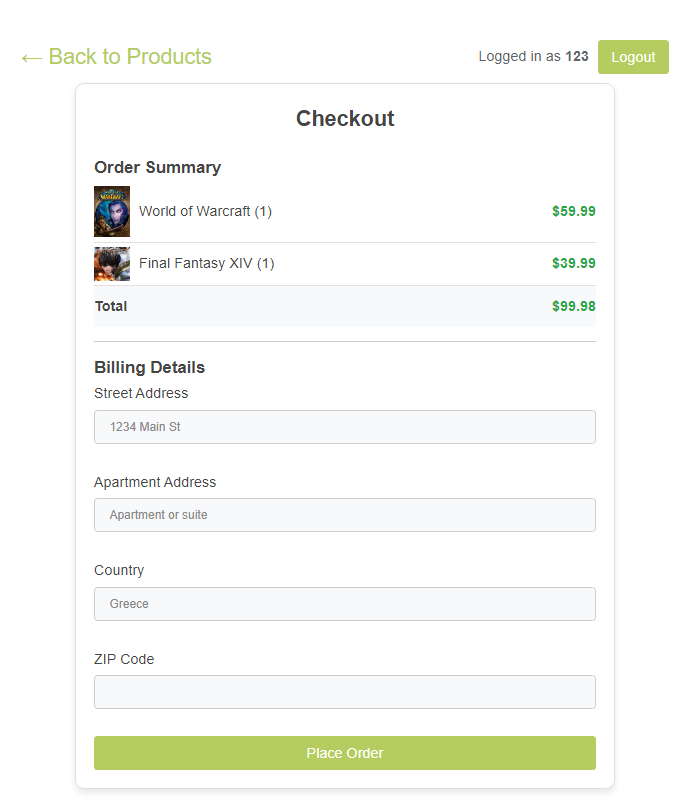
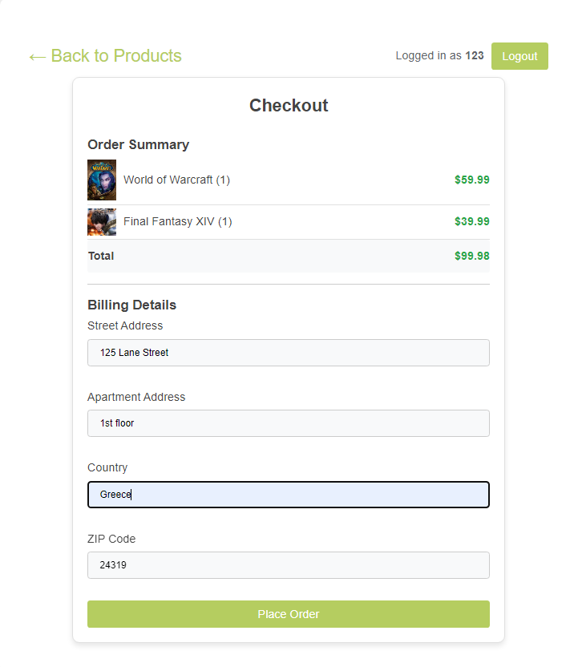
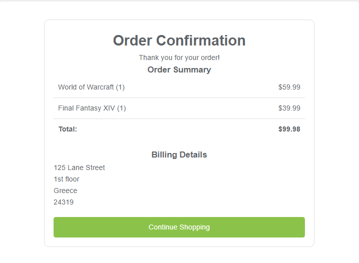

# E-Shop Project

This project is an e-commerce experimental platform for the Software Security course.

## Getting Started

These instructions will get you a copy of the project up and running on your local machine for development and testing purposes.

### Prerequisites

Make sure you have the following software installed:

- Python 3.11.2
- PostgreSQL 13+
- pgAdmin 8.6

### Installing

#### Setting up the Backend (Django)

1. **Clone the repository:**

    `git clone https://github.com/ChrisDaskalos/e-shop_softsec.git`
    `cd e-shop_softsec`

2. **Set up a virtual environment:**

    `python -m venv venv`
    `source venv/bin/activate`

    
    **On Windows use:**

    `venv\Scripts\activate`

3. **Install the required Python packages:**
   

    `pip install -r requirements.txt`

4. **Set up the database:**

    - Ensure PostgreSQL is running and create a database named `eshopdb`.
    - Create a user named `eshopuser` with password `1234` and grant all privileges on the database.

5. **Apply migrations:**

    `python manage.py makemigrations`
    `python manage.py migrate`

6. **Run the SSL server:**

    Before running the SSL server, make sure you have SSL certificates placed in the `ssl` directory of your project.

    `python manage.py runsslserver`

## Available Pages

Below is a list of all the available pages in the e-shop project:

### 1. Login Page

**URL:** `/`

**Description:** This is the landing page where users can log in to their accounts.

### 2. Product Catalogue Page

**URL:** `/products/`

**Description:** Displays the product catalogue available to authenticated users. Users can search for products and add them to their cart.

### 3. Add to Cart

**URL:** `/add_to_cart/<product_id>/`

**Description:** Adds a selected product to the user's shopping cart.

### 4. Cart and Checkout Page

**URL:** `/checkout/`

**Description:** Shows the items in the user's cart and allows them to enter their shipping information. Users can review their order details and submit the order.

### 5. Order Summary Page

**URL:** `/order_summary/`

**Description:** Provides a summary of the user's order before final submission.

### 6. Order Confirmation Page

**URL:** `/order_confirmation/`

**Description:** Displays the confirmation of the user's order once it has been successfully placed.

### 7. Logout

**URL:** `/logout/`

**Description:** Logs the user out and redirects them to the login page.

## Security Features

The e-shop project implements several security features:

1. **HTTPS Only:** All content is available only via HTTPS.
2. **Secure Cookies:** Session and CSRF cookies are configured to be secure.
3. **HTTPOnly Cookies:** Cookies are marked as HTTPOnly to prevent JavaScript access.
4. **CSRF Protection:** Cross-Site Request Forgery protection is enabled.
5. **Rate Limiting:** Rate limiting is implemented on login attempts.
6. **Content Security Policy (CSP):** The application has a Content Security Policy to mitigate XSS attacks.
7. **HSTS:** HTTP Strict Transport Security is enforced to ensure all communication is over HTTPS.

## Development

### Running the Development Server

To start the development server, use:

`python manage.py runsslserver`
